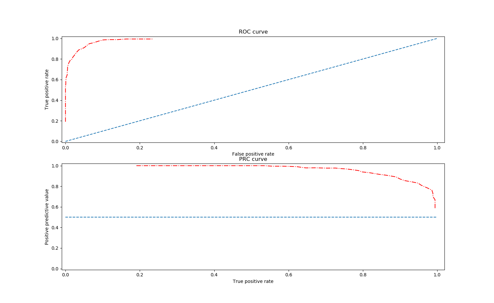

# Emergency Detection using Vocal Signals

EDVS (Emergency Detection using Vocal Signals) is a system that is designed to give people peace of mind. Its main objective is to alert staff when people are in distress so that they don’t go unnoticed in times of need.

 <kbd></img></kbd> 
 
 <kbd></img></kbd> 

## Hardware

Board:​Raspberry Pi 3B+ 
Microphone:​Saramonic SR-XM13.5mm TRS 
SoundCard:​Inno-Maker RPI USB Audio Card 5V Powered PCM2912 

## Status

